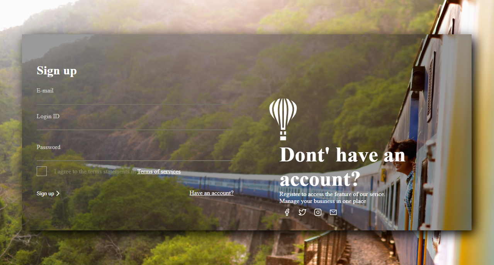

<h4 align="center">
  React Login Screen Interface
</h4>

  

  <a href="">Tecnologias</a> &nbsp; &nbsp; | &nbsp; &nbsp;
  <a href="">Projeto</a> &nbsp; &nbsp; | &nbsp; &nbsp;
  <a href="">Licença</a>

  
 

## Tecnologias

- [React](https://reactjs.org)

## Projeto

Simple User Interface without funcionality made in React

[Design - Aditya Sutar](https://dribbble.com/shots/11522403--DailyUI-Day-23-onboarding)

## Licença

This project is under MIT license
